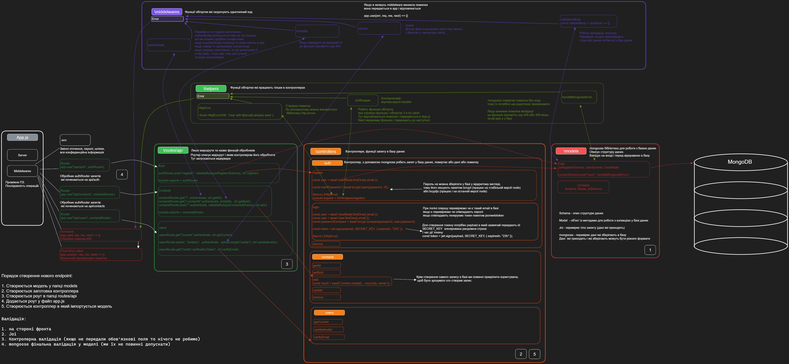

## GoIT Node.js Homework

Ціль проекту: ознайомитись із Node.js та написати бекенд

### Кожна гілка вирішує якусь специфічну задачу

- hw02 - express (basic server)
- hw03 - mongodb (connect to data base)
- hw04 - auth (register user)
- hw05 - avatars (change avatars)
- hw06 - email (email confirmation)

### Команди:

- `npm start` &mdash; старт сервера в режимі production
- `npm run start:dev` &mdash; старт сервера в режимі розробки (development)
- `npm run lint` &mdash; запустити виконання перевірки коду з eslint, необхідно
  виконувати перед кожним PR та виправляти всі помилки лінтера
- `npm lint:fix` &mdash; та ж перевірка лінтера, але з автоматичними
  виправленнями простих помилок
